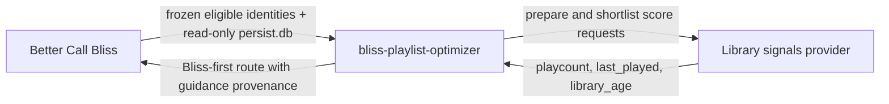

# bliss-guidance-library-signals

`bliss-guidance-library-signals` is an optional
[Bliss guidance SPI](https://github.com/chrober/bliss-playlist-guidance-spi)
provider for Lyrion's own listening and library history. It supplies three
small, normalized signals while leaving Bliss as the authority for acoustic
similarity, eligibility, repeat windows, and route validity.

| Channel | Source in Lyrion `persist.db` | What its signed host policy can prefer |
| --- | --- | --- |
| `playcount` | `tracks_persistent.playCount` | less- or more-played tracks |
| `last_played` | `tracks_persistent.lastPlayed` | longer-unheard or recently played tracks |
| `library_age` | `tracks_persistent.added` | older or newer library additions |

The provider is started by a compatible host such as
[bliss-playlist-optimizer](https://github.com/chrober/bliss-playlist-optimizer),
not by Lyrion directly. Better Call Bliss supplies a trusted, read-only
`persist.db` descriptor and the frozen eligible candidate identities. The
provider never uses or requires Alternative Play Count (APC); APC-based
guidance is intentionally future, separate work.

At preparation, the provider verifies the identity artifact, opens one
read-only SQLite snapshot, and retains only three frequency distributions.
At scoring, it queries only the optimizer's already-admitted shortlist and
caches those job-local results. Rows missing from `tracks_persistent`, and
missing `added` values, remain neutral rather than receiving invented ranks.

See the [SPI contract](https://github.com/chrober/bliss-playlist-guidance-spi)
for the host-neutral JSONL protocol and the optimizer repository for the
host-side orchestration.
