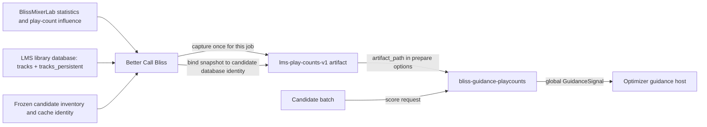

# bliss-guidance-playcounts

`bliss-guidance-playcounts` is a provider addon for the
`bliss-playlist-optimizer` guidance SPI. It reads an `lms-play-counts-v1` raw
snapshot, maps counts to stable candidate identities, and returns bounded global
preference guidance for each requested candidate. The optimizer applies the
job's signed play-count influence; this addon does not decide hard eligibility
or route validity.

Its SPI provider ID is `playcount-guidance`. It reads a frozen snapshot rather
than querying LMS directly, so addon execution remains deterministic and
network-free.

## Data and information flow



Better Call Bliss owns the user-facing play-count policy. It reads the enabled
statistics state and signed play-count influence from the compatible
BlissMixerLab capability snapshot, then carries the resulting job value in the
optimizer request. For a job that needs play counts, Better Call Bliss queries
the LMS `tracks` and `tracks_persistent` tables, maps local URLs to Bliss
`database_file` identities, yields between batches to keep LMS responsive, and
writes a frozen `lms-play-counts-v1` artifact. The artifact includes the
database cache identity and capture time, so it is bound to the same analyzed
library snapshot as the candidate inventory.

This add-on consumes no LMS database, BlissMixerLab setting, or Better Call
Bliss setting directly. Its only configuration is the trusted `artifact_path` in
the SPI `prepare` request. That makes provider execution deterministic and keeps
LMS database access outside the native route-search process.

During `prepare`, the add-on reads the artifact once, keeps each candidate's
count keyed by `database_file`, and converts distinct observed counts to a
stable percentile. Missing counts are represented as zero for ordering, matching
the existing optimizer contract. For `score`, it returns a global signal for
each requested candidate present in the snapshot: the lowest percentile maps to
`-1`, the highest to `+1`, and intermediate counts map linearly between them.
The signed per-job influence determines whether the host would later prefer
more- or less-played tracks; this provider itself does not choose a direction.

The current optimizer host records these signals and diagnostics, but its first
SPI gate does not yet apply them to route selection. The existing request-level
play-count contract remains the active compatibility path until shared host-side
reranking is connected.

The addon communicates through versioned JSONL on stdin/stdout. It is intended
to be discovered and started by the optimizer, not called directly by LMS.

Prepare options:

```json
{ "artifact_path": "/path/to/play-counts.json" }
```

Unknown counts are treated as zero for percentile ordering, matching the
optimizer's current play-count contract. The provider remains network-free and
does not access the LMS database directly.
