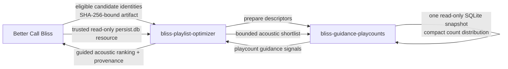

# bliss-guidance-playcounts

`bliss-guidance-playcounts` is an optional provider for the
[`bliss-playlist-guidance-spi`](https://github.com/chrober/bliss-playlist-guidance-spi).
It supplies a small, bounded preference signal based on Lyrion play counts;
Bliss remains the authority for acoustic similarity, hard eligibility, repeat
windows, and route validity.

The provider is started and controlled by `bliss-playlist-optimizer`, not by
Lyrion directly. Better Call Bliss supplies only trusted, job-owned artifact
and resource descriptors. It does not export a full-library play-count JSON
snapshot.

## Data flow

Better Call Bliss captures the selected virtual-library membership and writes
the compact `eligible-candidate-identities-v1` artifact. Each record carries a
stable `candidate_id` and Lyrion `lms_urlmd5`. It also supplies the
plugin-owned, read-only path to Lyrion's `persist.db`; neither path can come
from a web-form parameter.

At `prepare`, the provider verifies the identity artifact's SHA-256, opens
`persist.db` read-only, enables `PRAGMA query_only`, begins one SQLite snapshot,
and validates `tracks_persistent(urlmd5, playcount)`. It streams the frozen
eligible identities through batches of at most 900 values; a batch lookup is
discarded before the next batch. It retains only a frequency distribution of
their counts, never a whole-library `urlmd5 -> playcount` map. Missing rows and
null counts are treated as zero.

At `score`, the optimizer sends only its already-admitted acoustic shortlist.
The provider looks up just that batch's uncached URLMD5 values against the same
snapshot, caches those values for the rest of the job, and emits `playcount`
signals in `[-1, 1]`. Equal count values receive the same average-rank
percentile. The optimizer applies the job's signed influence later, so this
provider does not decide whether frequently or rarely played tracks are wanted.

## Failure and performance behavior

The provider performs no network requests and never loads a full
`urlmd5 -> playcount` library map. SQLite lock, schema, artifact, or I/O
failures return a provider error for the optimizer to treat as neutral advice;
the Bliss-only playlist job can continue. `close` releases the read snapshot
and score cache promptly.

Diagnostics report population size, known and zero counts, distribution size,
the largest preparation lookup batch, bounded query-batch counts, cache hits,
and elapsed time. A generated 200,000-identity regression fixture verifies the
bounded preparation path and score-cache reuse without committing a large test
asset. Diagnostics do not expose private filesystem paths.
